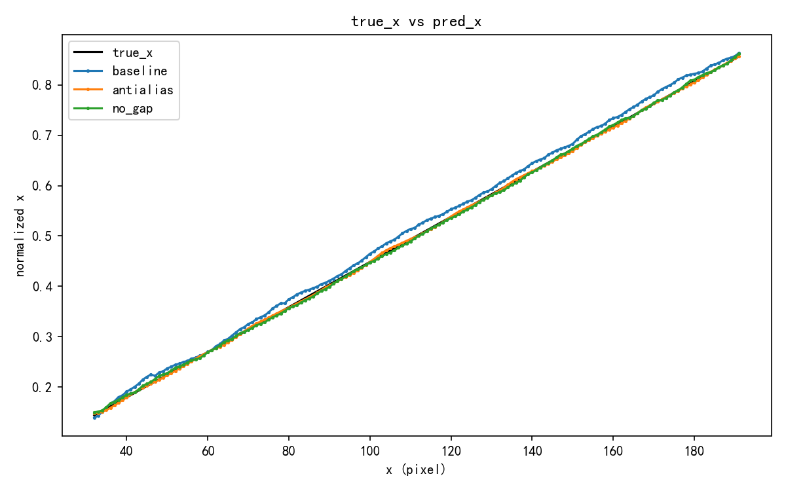
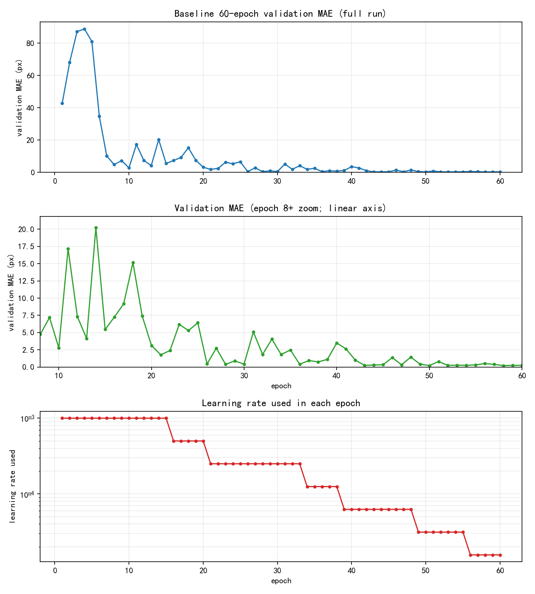
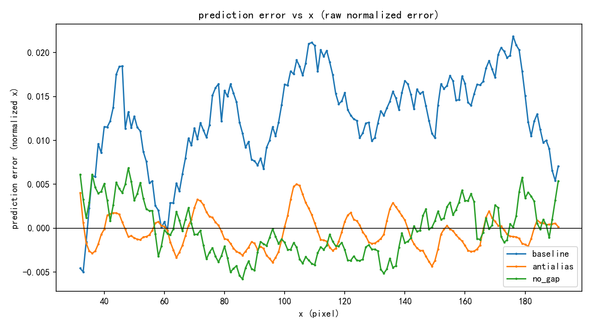
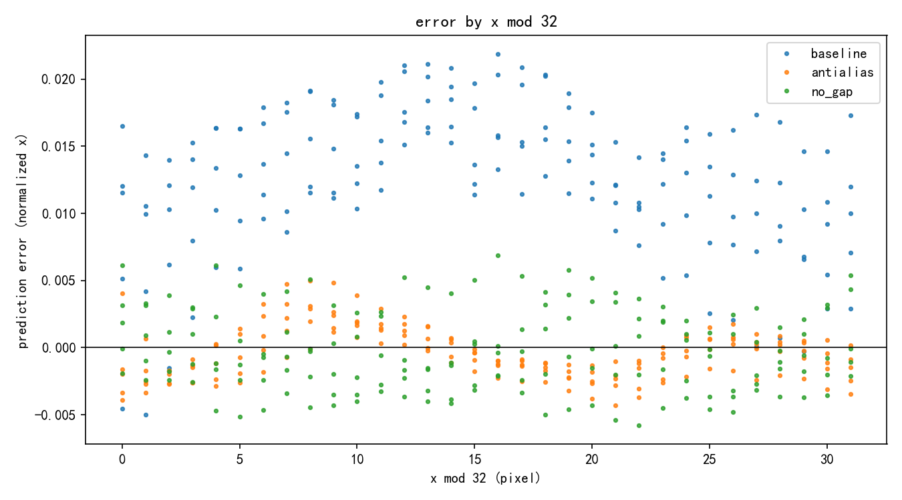
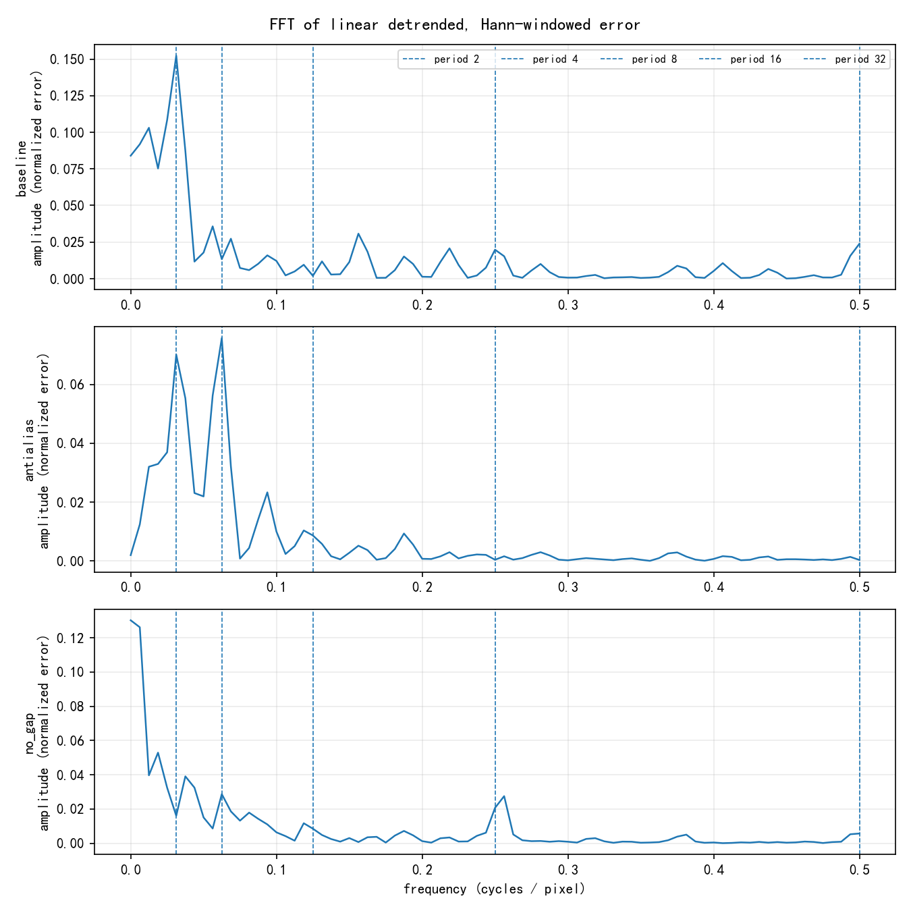

# ResNet18 stride/downsampling 相位敏感性实验

[](LICENSE)

这是一个可复现的小型 PyTorch 实验，用合成的“黑底白色短线”坐标回归任务，检查标准
`torchvision.models.resnet18(weights=None)` 的 stride/downsampling 是否会引入平移相位敏感性，以及坐标误差是否出现 2/4/8/16/32 像素周期。

仓库包含完整实验脚本和精选 CSV/PNG 结果；生成数据、模型 checkpoint 和其他大文件不纳入 Git。

## 要回答的问题

1. 原版 ResNet18 保留最终 `AdaptiveAvgPool2d((1, 1))` 时，能否稳定区分相差 1 px 的位置？
2. 坐标误差是否呈现与累计 stride 对应的 2/4/8/16/32 px 周期？
3. 这种周期性能否支持“downsampling phase 提供细粒度位置信号”的假设？
4. anti-aliasing 是否减弱周期误差和 feature 非等变性？
5. 去掉 GAP、保留最后 7×7 feature map 后，坐标回归是否更容易？

## 实验设计

| 项目 | 设置 |
|---|---|
| 图像 | 224×224，黑底白线 |
| 几何图形 | 长 21 px、宽 3 px 的固定水平短线 |
| 固定位置 | `y=112` |
| 回归目标 | 线段中心 `x / 223` |
| 训练集 | 810 张，非整数 sub-pixel x offsets |
| 验证集 | 810 张，与训练集不同的 sub-pixel offsets |
| Dense test | `x=32..191`，160 个连续整数位置，即 5×32 |
| 随机种子 | `20260810` |
| 优化器 | AdamW，初始 LR `1e-3`，weight decay `1e-4` |
| Batch size | 64 |

数据由脚本预先生成并冻结到本地 NPZ，训练阶段不会在线随机渲染。训练、验证和 dense test 使用独立的 x offsets；dense sweep 远离线段裁切边界。

### 模型变体

- **baseline**：原版 `resnet18(weights=None)`，保留 GAP，只把最终 `fc` 改为单坐标回归头。
- **antialias**：在每个 stride-2 decimation 处使用固定 3×3 binomial depthwise blur-pooling，并保持相同累计 output stride。
- **no_gap**：去掉最终 GAP，把最后的 `512×7×7` feature 展平后接一个小 MLP。

`no_gap` 有约 17.60M 参数，baseline/antialias 约 11.18M，因此 no-GAP 结果同时混合了空间信息和更大 head 容量，不能直接解释为 GAP 的单一因果效应。

## 运行方法

要求 Python、PyTorch、torchvision、NumPy 和 Matplotlib。实验实测环境为 Python 3.12、PyTorch 2.12.0、torchvision 0.27.0；有 CUDA 时自动使用 CUDA。

```powershell
python -m pip install -r requirements.txt

# 只读检查，不训练
python resnet_phase_experiment.py check

# 数据生成与训练明确分开
python resnet_phase_experiment.py prepare
python resnet_phase_experiment.py train
python resnet_phase_experiment.py analyze
python resnet_phase_experiment.py equivariance --equiv-source trained
```

60 epoch baseline 补充实验复用主脚本生成的数据和完全相同的前 20 epoch 训练协议：

```powershell
python supplemental_baseline_long.py --check-only
python supplemental_baseline_long.py
```

生成物默认写到脚本旁的 `outputs/`。该目录、NPZ 数据和 `.pt` checkpoint 已由 `.gitignore` 排除；仓库中的 `results/` 是本次运行后人工筛选的轻量结果。

## 关键结果

### 坐标定位

| 模型 / checkpoint | 训练预算 | Dense MAE | RMSE | 最大绝对误差 | 相邻预测步长均值 | 非单调比例 |
|---|---:|---:|---:|---:|---:|---:|
| baseline epoch 10 | 10 | 2.889 px | 3.092 px | 4.970 px | 1.0166 px | 0.63% |
| antialias best | 20 | 0.359 px | 0.434 px | 1.116 px | 0.9946 px | 0 |
| no_gap best | 20 | 0.566 px | 0.668 px | 1.528 px | 0.9989 px | 0 |
| baseline epoch 60 | 60 | 0.261 px | 0.305 px | 0.764 px | 0.9980 px | 0 |
| **baseline best (epoch 50)** | **60 内验证集选择** | **0.200 px** | **0.246 px** | **0.668 px** | **0.9983 px** | **0** |

baseline 最佳 checkpoint 在 160 个连续整数位置上保持完全单调，整体 bias 仅 `+0.059 px`。因此，在这个 toy setting 中，保留原始 GAP 的标准 ResNet18 能稳定区分相差 1 px 的位置。

不同训练预算不能用来判断最终架构优劣：20 epoch 结果说明 antialias/no-GAP 收敛更快；baseline 60 epoch 则说明原先约 3 px 的误差并不是固定的结构上限。

下面的三模型对比图来自统一 20 epoch 主实验；60 epoch baseline 的独立训练曲线紧随其后。





### 周期性随训练显著减弱

baseline 的 detrended residue mean peak-to-peak：

| checkpoint | P2 | P4 | P8 | P16 | P32 |
|---|---:|---:|---:|---:|---:|
| epoch 10 | 0.120 | 0.245 | 0.265 | 0.435 | **2.549 px** |
| best epoch 50 | 0.039 | 0.207 | 0.245 | 0.335 | **0.408 px** |

经过线性去趋势和 Hann window 后，精确 P32 FFT bin 的振幅从 epoch 10 的 `0.847 px` 降到最佳 checkpoint 的 `0.068 px`。P32 residue 降低约 84%，FFT 振幅降低约 92%。

这说明训练不足的 baseline 有很强的 32 px 周期误差，但充分训练后只剩低幅度周期成分。当前数据没有显示一个稳定、清晰的完整 2/4/8/16/32 周期阶梯。







### 1 px 平移的 feature 非等变性

单个固定样本、1 px 输入平移、fractional alignment 后的 normalized L1：

| Stage | 累计 stride | baseline | antialias | no_gap |
|---|---:|---:|---:|---:|
| conv1 | 2 | 0.056 | 0.023 | 0.063 |
| maxpool | 4 | 0.078 | 0.034 | 0.080 |
| layer1 | 4 | 0.058 | 0.025 | 0.056 |
| layer2 | 8 | 0.044 | 0.023 | 0.036 |
| layer3 | 16 | 0.031 | 0.023 | 0.030 |
| layer4 | 32 | 0.024 | 0.020 | 0.019 |

所有 stage 对 1 px 平移都不是严格等变的；maxpool 附近差异最大，anti-alias 明显减小早期 stage 的差异。深层 normalized difference 较小并不等价于深层严格等变，也可能受到空间分辨率、平滑和归一化尺度影响。


## 初步结论

- 标准 ResNet18 的 stride/downsampling 确实会产生可测量的平移相位敏感性。
- 训练不足时，坐标误差可出现很强的 32 px 周期；但它不是不可避免的结构极限。
- 充分训练后的原版 GAP baseline 在本任务上达到 `0.200 px` dense MAE，能够稳定区分 1 px 平移。
- 定位越准确，强 P32 周期反而越弱。因此当前结果支持“phase sensitivity 存在”，但不支持它是精确定位所必需的主要信号；它也可能是一种网络需要学习补偿的扰动。
- Anti-alias 明显改善有限训练预算下的收敛速度以及早期 feature 的平移稳定性，但没有统一消除所有 P16/P32 成分。
- 去掉 GAP 在 20 epoch 下更容易优化，但标准 GAP 并非精确定位的根本障碍；容量匹配对照仍然必要。

## 证据边界

这是单 seed、单条水平线、单一长度/y 位置和固定 224×224 分辨率的探索性实验。要形成更强的机制或普适结论，至少还应补充：

1. baseline/antialias/no-GAP 使用相同充分训练或统一 early stopping；
2. 至少 3 个模型随机种子；
3. no-GAP linear 或 GAP+MLP 容量匹配对照；
4. 多个 x/y、线长和方向的 feature 等变性统计；
5. FFT shuffle/null 或 bootstrap 检验。

## 仓库结构

```text
.
├── resnet_phase_experiment.py
├── supplemental_baseline_long.py
├── requirements.txt
├── results/
│   ├── main/                 # 三模型 20 epoch 分析和等变性结果
│   └── baseline_60ep/        # baseline 延长训练结果
├── LICENSE
└── README.md
```

## License

[MIT](LICENSE)
