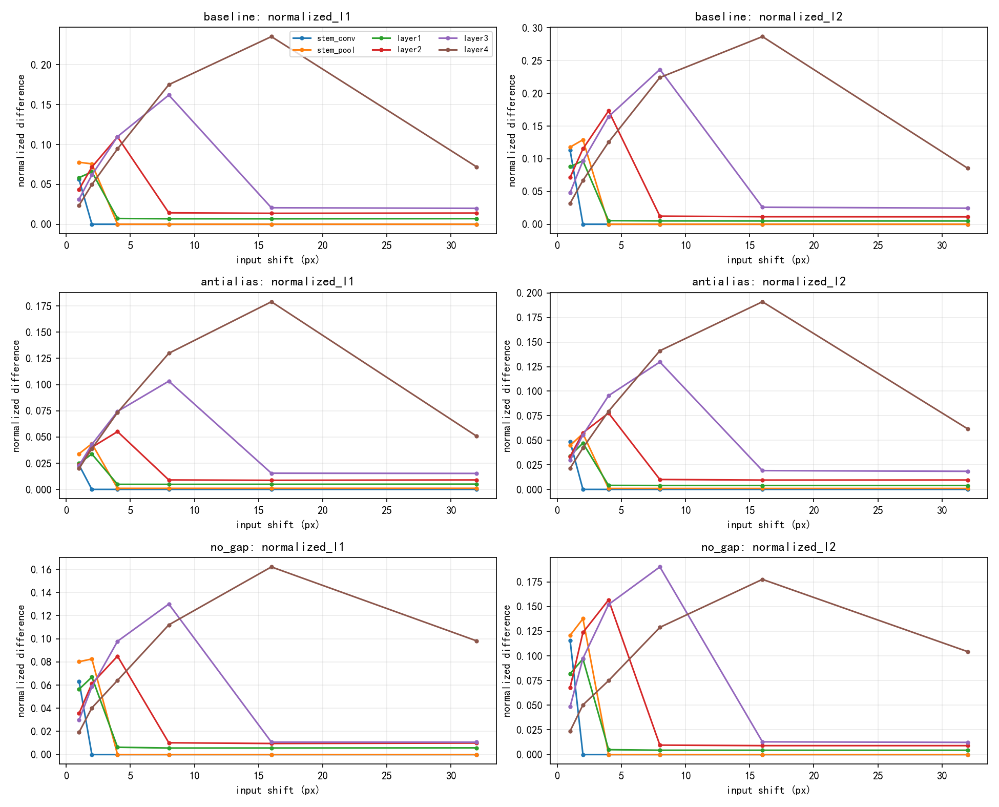
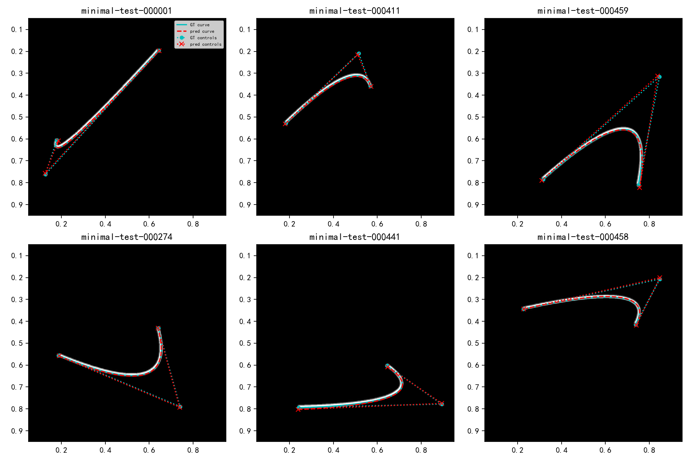
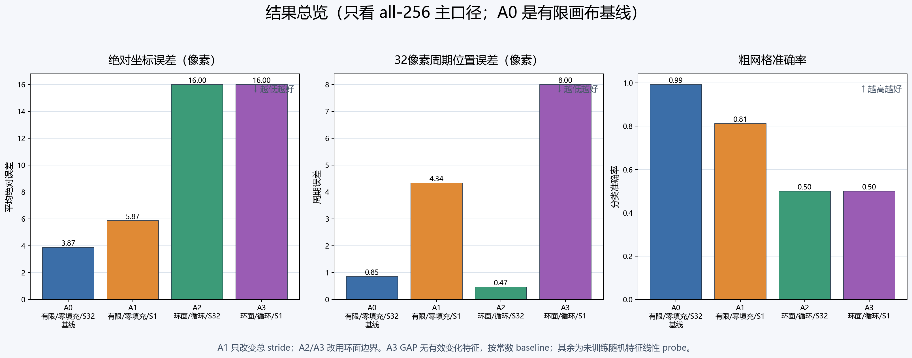

# Neural Geometry and Spatial Representation Experiments

[简体中文](README_CN.md)

This repository is a curated public snapshot of a completed research project on
geometric localization, spatial representation, and off-support behavior in
convolutional models.

It is intended as a research archive and project showcase. It is **not** a
complete, immediately runnable release of the original local workspace.

## Research scope

The project examines how neural networks infer positions, translations, and
geometric parameters from rendered images, with particular attention to:

- stride, anti-aliasing, global average pooling, and spatial representations;
- image-to-coordinate and image-to-Bézier-curve inverse problems;
- sparse support points and off-support generalization;
- frozen features, linear probes, Neural Affine variants, and NTK analyses;
- boundary conditions, finite domains, and function-selection mechanisms;
- optimization dynamics, recovery behavior, and controlled architecture tests.

## Research timeline

| Stage | Main focus |
|---|---|
| Early experiments | Position regression, stride/downsampling phase sensitivity, anti-aliasing, GAP, and Bézier inversion |
| Phase 1–1.8 | Frozen GAP representations, spatial factors, subspace probes, and unseen translations |
| Phase 2 | Position coverage, architecture, padding, content, symmetry, and recovery behavior |
| Phase 3 | Operators, group/equivariance tests, content, resolution, initialization, and representation diagnostics |
| S0 / S1 | Clean-room materialization, Neural Affine controls, crossover analysis, and independent audits |
| Track A | Small controlled tests of a specified finite-boundary mechanism |
| Track B | Function-selection experiments and post-hoc mechanism diagnostics |

See [the detailed timeline](docs/RESEARCH_TIMELINE.md) and the
[Chinese experiment summary](docs/EXPERIMENT_SUMMARY_CN.md).

## Repository layout

```text
experiments/
  legacy/                 early phase-sensitivity and Bézier entry points
  phase_and_mechanism/    selected Phase 1/2/3 and mechanism code
  neural_affine/          selected S0, S1, and crossover code
  tracks/                 selected Track A/B code and tests
docs/                     summaries, timeline, and archival notes
showcase/                 selected figures and compact result tables
```

## What is included

- selected experiment source code and tests;
- research protocols and small configuration files;
- factual research summaries and evidence notes;
- selected figures and aggregate tables;
- a compact subset of the lightweight results already public in the original repository.

## What is intentionally omitted

- model weights, checkpoints, dense fields, and large binary artifacts;
- generated datasets and complete prediction dumps;
- cloud, machine, deployment, transfer, and storage-operation materials;
- device inventories, environment snapshots, network records, and credentials;
- large archives, logs, caches, temporary files, and full formal-run returns.

These omissions are intentional. The public repository documents the research
direction and evidence trail; it does not mirror the complete local execution
archive.

## Reproducibility and historical paths

The retained scripts were written across several execution environments. Some
files still contain historical absolute paths or environment-specific defaults.
Those paths were deliberately not rewritten during archival cleanup.

If reusing the code:

1. work in a separate copy;
2. inspect and adapt paths and dependencies for the target environment;
3. do not assume scripts run from the repository root;
4. treat archived manifests and reports as historical records.

More detail is in [the archive and path note](docs/ARCHIVE_AND_PATH_NOTE.md).

## Selected views

The [showcase index](showcase/README.md) links selected figures and compact
tables. A few examples are shown below.







## Evidence boundaries

The archive distinguishes formal results, supplementary analyses, diagnostics,
and incomplete runs. It also distinguishes audit of an existing artifact from
independent reproduction of an experiment.

Several experiments use a fixed synthetic protocol or a limited number of
seeds. Numerical agreement within one protocol should not be treated as a
universal claim about all architectures, datasets, or training procedures.

## License

See [LICENSE](LICENSE).
