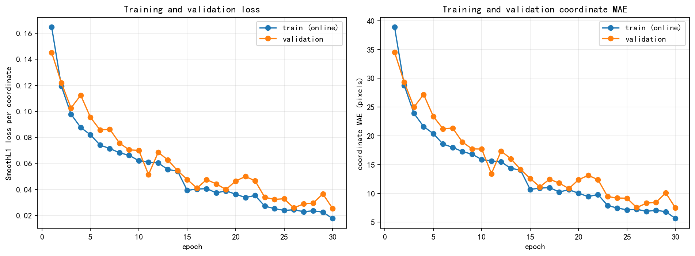
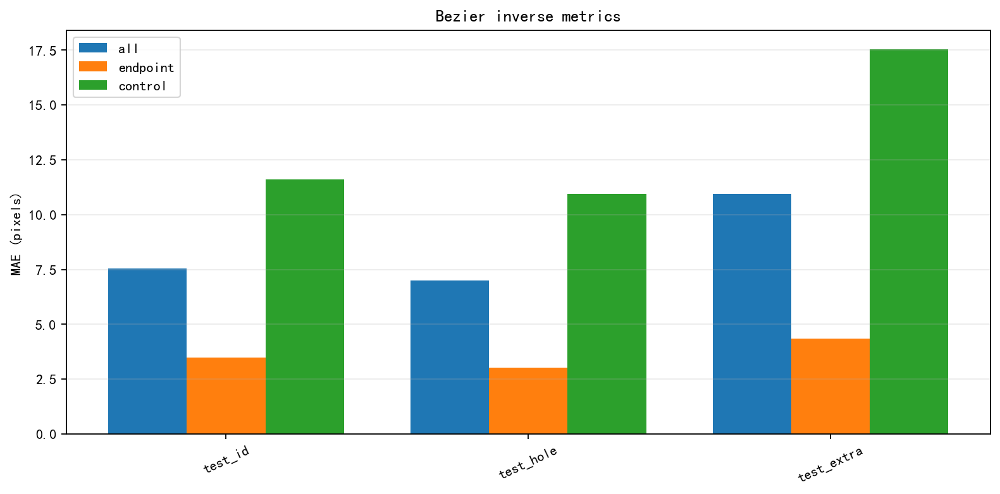
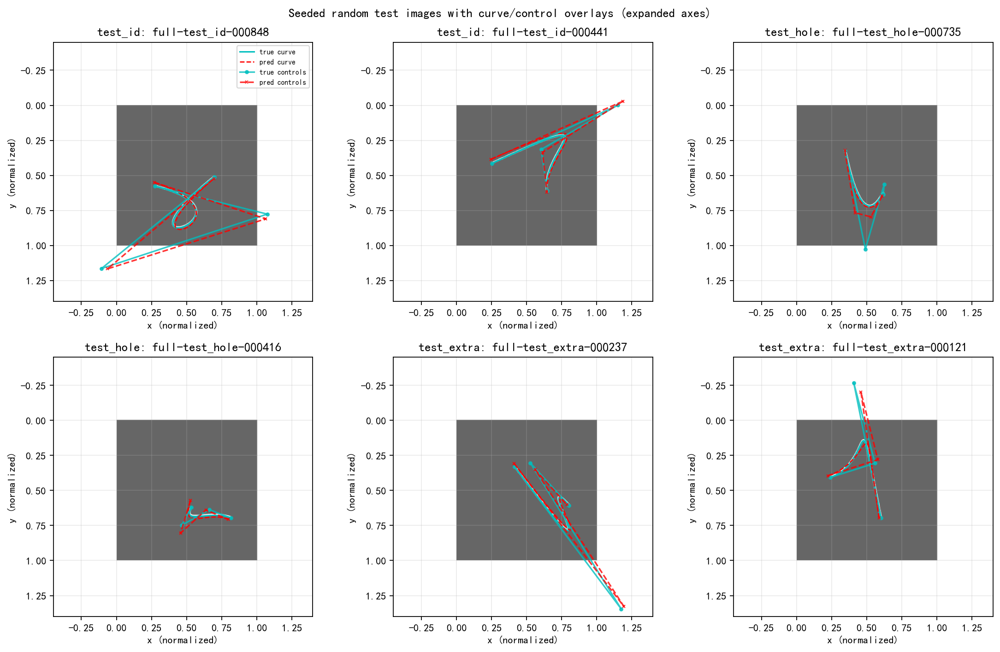
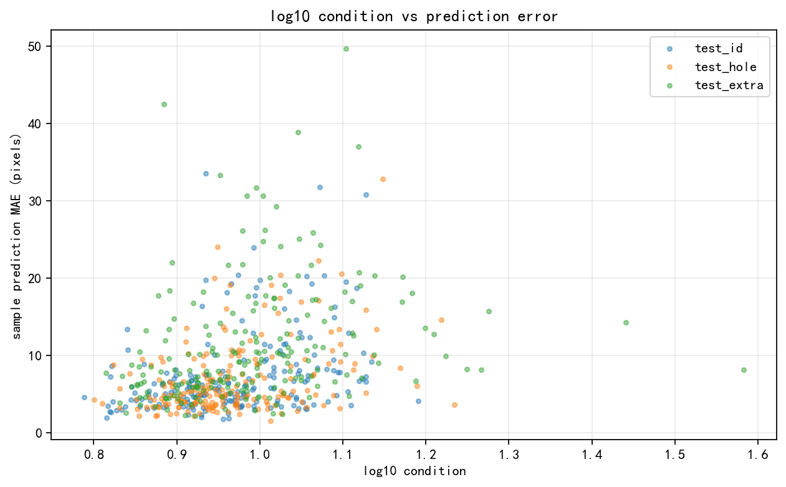
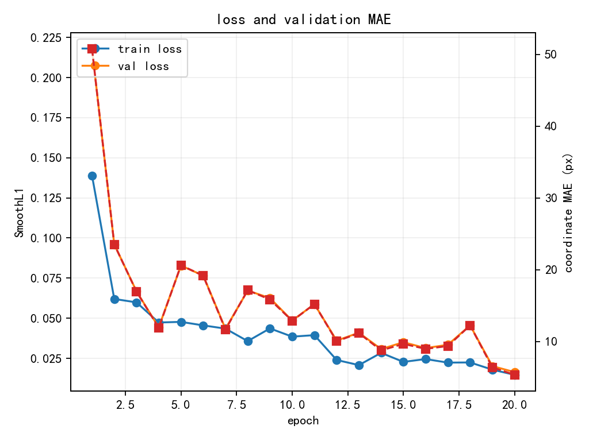
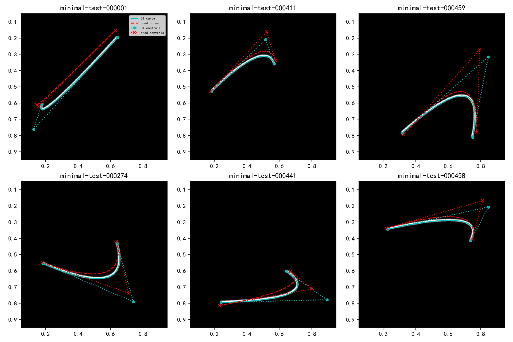
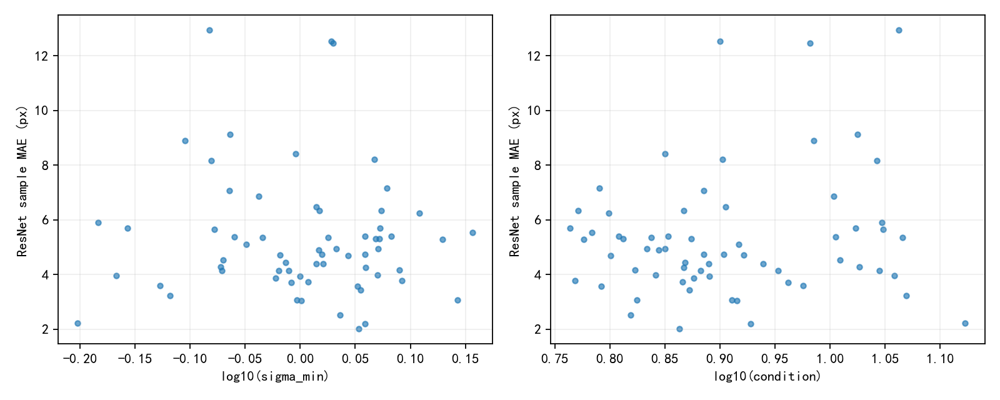

# ResNet18 stride/downsampling 相位敏感性实验
[English](README.md) | 简体中文

[](LICENSE)

这是一个可复现的小型 PyTorch 实验，用合成的“黑底白色短线”坐标回归任务，检查标准
`torchvision.models.resnet18(weights=None)` 的 stride/downsampling 是否会引入平移相位敏感性，以及坐标误差是否出现 2/4/8/16/32 像素周期。

仓库还包含一个完全独立的三次 Bézier 几何反演实验，用同一个标准 ResNet18、原始 GAP 和单层线性 head，从 raster 图像恢复 8 个连续控制点坐标，并检查画布外控制点、参数空间挖洞和超出训练范围时的泛化能力。

仓库包含完整实验脚本和精选 CSV/PNG 结果；生成数据、模型 checkpoint 和其他大文件不纳入 Git。

## 要回答的问题

1. 原版 ResNet18 保留最终 `AdaptiveAvgPool2d((1, 1))` 时，能否稳定区分相差 1 px 的位置？
2. 坐标误差是否呈现与累计 stride 对应的 2/4/8/16/32 px 周期？
3. 这种周期性能否支持“downsampling phase 提供细粒度位置信号”的假设？
4. anti-aliasing 是否减弱周期误差和 feature 非等变性？
5. 去掉 GAP、保留最后 7×7 feature map 后，坐标回归是否更容易？

## 实验设计

| 项目 | 设置 |
|---|---|
| 图像 | 224×224，黑底白线 |
| 几何图形 | 长 21 px、宽 3 px 的固定水平短线 |
| 固定位置 | `y=112` |
| 回归目标 | 线段中心 `x / 223` |
| 训练集 | 810 张，非整数 sub-pixel x offsets |
| 验证集 | 810 张，与训练集不同的 sub-pixel offsets |
| Dense test | `x=32..191`，160 个连续整数位置，即 5×32 |
| 随机种子 | `20260810` |
| 优化器 | AdamW，初始 LR `1e-3`，weight decay `1e-4` |
| Batch size | 64 |

数据由脚本预先生成并冻结到本地 NPZ，训练阶段不会在线随机渲染。训练、验证和 dense test 使用独立的 x offsets；dense sweep 远离线段裁切边界。

### 模型变体

- **baseline**：原版 `resnet18(weights=None)`，保留 GAP，只把最终 `fc` 改为单坐标回归头。
- **antialias**：在每个 stride-2 decimation 处使用固定 3×3 binomial depthwise blur-pooling，并保持相同累计 output stride。
- **no_gap**：去掉最终 GAP，把最后的 `512×7×7` feature 展平后接一个小 MLP。

`no_gap` 有约 17.60M 参数，baseline/antialias 约 11.18M，因此 no-GAP 结果同时混合了空间信息和更大 head 容量，不能直接解释为 GAP 的单一因果效应。

## 运行方法

要求 Python、PyTorch、torchvision、NumPy、Matplotlib 和 Pillow。实验实测环境为 Python 3.12、PyTorch 2.12.0、torchvision 0.27.0；有 CUDA 时自动使用 CUDA。

```powershell
python -m pip install -r requirements.txt

# 只读检查，不训练
python resnet_phase_experiment.py check

# 数据生成与训练明确分开
python resnet_phase_experiment.py prepare
python resnet_phase_experiment.py train
python resnet_phase_experiment.py analyze
python resnet_phase_experiment.py equivariance --equiv-source trained
```

60 epoch baseline 补充实验复用主脚本生成的数据和完全相同的前 20 epoch 训练协议：

```powershell
python supplemental_baseline_long.py --check-only
python supplemental_baseline_long.py
```

生成物默认写到脚本旁的 `outputs/`。该目录、NPZ 数据和 `.pt` checkpoint 已由 `.gitignore` 排除；仓库中的 `results/` 是本次运行后人工筛选的轻量结果。

## 关键结果

### 坐标定位

| 模型 / checkpoint | 结果来源 | 训练预算 | Dense MAE | RMSE | 最大绝对误差 | 相邻预测步长均值 | 非单调比例 |
|---|---|---:|---:|---:|---:|---:|---:|
| baseline best (epoch 10) | 统一 20 轮主实验 | 20 | 2.863 px | 3.065 px | 4.877 px | 1.0163 px | 0.63% |
| antialias best | 统一 20 轮主实验 | 20 | 0.359 px | 0.434 px | 1.116 px | 0.9946 px | 0 |
| no_gap best | 统一 20 轮主实验 | 20 | 0.566 px | 0.668 px | 1.528 px | 0.9989 px | 0 |
| baseline epoch 10 | 60 轮补充运行 | 10 | 2.889 px | 3.092 px | 4.970 px | 1.0166 px | 0.63% |
| baseline epoch 60 | 60 轮补充运行 | 60 | 0.261 px | 0.305 px | 0.764 px | 0.9980 px | 0 |
| **baseline best (epoch 50)** | **60 轮补充运行** | **60 轮中验证集最佳 checkpoint** | **0.200 px** | **0.246 px** | **0.668 px** | **0.9983 px** | **0** |

补充运行的 epoch-10 checkpoint 与主实验 baseline 最佳 checkpoint 的模型权重完全相同；两份分析脚本采用的推理精度路径不同——主分析使用全精度，补充分析在 CUDA 下使用 AMP/autocast——因此 dense 指标存在很小差异。

baseline 最佳 checkpoint 在 160 个连续整数位置上保持完全单调，整体 bias 仅 `+0.059 px`。因此，在这个 toy setting 中，保留原始 GAP 的标准 ResNet18 能稳定区分相差 1 px 的位置。

不同训练预算不能用来判断最终架构优劣：20 epoch 结果说明 antialias/no-GAP 收敛更快；baseline 60 epoch 则说明原先约 3 px 的误差并不是固定的结构上限。

下面的三模型对比图来自统一 20 epoch 主实验；60 epoch baseline 的独立训练曲线紧随其后。


### 周期性随训练显著减弱

baseline 的 detrended residue mean peak-to-peak：

| checkpoint | P2 | P4 | P8 | P16 | P32 |
|---|---:|---:|---:|---:|---:|
| epoch 10 | 0.120 | 0.245 | 0.265 | 0.435 | **2.549 px** |
| best epoch 50 | 0.039 | 0.207 | 0.245 | 0.335 | **0.408 px** |

经过线性去趋势和 Hann window 后，精确 P32 FFT bin 的振幅从 epoch 10 的 `0.847 px` 降到最佳 checkpoint 的 `0.068 px`。P32 residue 降低约 84%，FFT 振幅降低约 92%。

这说明训练不足的 baseline 有很强的 32 px 周期误差，但充分训练后只剩低幅度周期成分。当前数据没有显示一个稳定、清晰的完整 2/4/8/16/32 周期阶梯。


### 1 px 平移的 feature 非等变性

单个固定样本、1 px 输入平移、fractional alignment 后的 normalized L1：

| Stage | 累计 stride | baseline | antialias | no_gap |
|---|---:|---:|---:|---:|
| conv1 | 2 | 0.056 | 0.023 | 0.063 |
| maxpool | 4 | 0.078 | 0.034 | 0.080 |
| layer1 | 4 | 0.058 | 0.025 | 0.056 |
| layer2 | 8 | 0.044 | 0.023 | 0.036 |
| layer3 | 16 | 0.031 | 0.023 | 0.030 |
| layer4 | 32 | 0.024 | 0.020 | 0.019 |

所有 stage 对 1 px 平移都不是严格等变的；maxpool 附近差异最大，anti-alias 明显减小早期 stage 的差异。深层 normalized difference 较小并不等价于深层严格等变，也可能受到空间分辨率、平滑和归一化尺度影响。


## 初步结论

- 标准 ResNet18 的 stride/downsampling 确实会产生可测量的平移相位敏感性。
- 训练不足时，坐标误差可出现很强的 32 px 周期；但它不是不可避免的结构极限。
- 充分训练后的原版 GAP baseline 在本任务上达到 `0.200 px` dense MAE，能够稳定区分 1 px 平移。
- 定位越准确，强 P32 周期反而越弱。因此当前结果支持“phase sensitivity 存在”，但不支持它是精确定位所必需的主要信号；它也可能是一种网络需要学习补偿的扰动。
- Anti-alias 明显改善有限训练预算下的收敛速度以及早期 feature 的平移稳定性，但没有统一消除所有 P16/P32 成分。
- 去掉 GAP 在 20 epoch 下更容易优化，但标准 GAP 并非精确定位的根本障碍；容量匹配对照仍然必要。

## 三次 Bézier 几何反演

`bezier_inverse_experiment.py` 与相位敏感性实验完全独立，只写入 `results/bezier_inverse/`。输入是四个控制点生成的三次 Bézier raster，输出是 8 个 normalized 坐标。模型严格使用 `torchvision.models.resnet18(weights=None)`，保留原始 `AdaptiveAvgPool2d((1,1))`，只把 `fc` 改成 `Linear(512, 8)`，不使用 sigmoid。

### 数据与训练协议

| 项目 | 设置 |
|---|---|
| Raster | 224×224 灰度图，4× supersampling、256 点 polyline、LANCZOS 下采样 |
| Train / validation | 8,000 / 1,000 个冻结样本 |
| ID / Hole / Extra test | 各 1,000 个样本 |
| 端点支持 | `P0,P3 ∈ (0.15,0.85)^2`，canonical `P0.x < P3.x`，水平间距 ≥ 0.20 |
| 控制点支持 | Train/val/ID：`P1,P2 ∈ [-0.25,1.25]^2` |
| Hole | `P1.x ∈ [0.35,0.55] AND P2.y ∈ [0.45,0.65]`，从 train/val/ID 排除 |
| Extra | 至少一个 P1/P2 坐标位于 `[-0.40,-0.25)` 或 `(1.25,1.40]` |
| 可见性 | 弧长加权 visible fraction ≥ 0.65 |
| 训练 | AdamW、LR `1e-3`、weight decay `1e-4`、batch 64、SmoothL1 beta 0.02、最多 30 epoch |

五个 split 都用固定 seed `20260810` 离线生成；脚本检查跨 split 的精确参数哈希和 raster 哈希。Smoke profile 用 500 个训练样本和 2 个 epoch 检查 renderer、训练、评估、PNG 和 Jacobian 全流程。

```powershell
# 完整 smoke 流程
python bezier_inverse_experiment.py all --profile smoke

# 正式实验分阶段运行
python bezier_inverse_experiment.py prepare --profile full
python bezier_inverse_experiment.py train --profile full
python bezier_inverse_experiment.py analyze --profile full
python bezier_inverse_experiment.py identifiability --profile full
```

冻结 NPZ 和 checkpoint 保留在本地并由 `.gitignore` 排除；CSV/JSON metadata、预测、指标、可识别性结果和 PNG 位于 `results/bezier_inverse/full/`。

### 正式单 seed 结果

验证集最佳 checkpoint 出现在 epoch 30，validation coordinate MAE 为 `7.47 px`。测试指标使用全精度推理。因为 Hole 子集的目标分布更窄、更容易，表中同时给出 train-mean 常数基线。

| Split | MAE normalized | MAE px | RMSE px | Endpoint MAE | Control MAE | Curve RMSE | Train-mean baseline | Model / baseline |
|---|---:|---:|---:|---:|---:|---:|---:|---:|
| ID | 0.0339 | 7.551 | 12.783 | 3.484 | 11.618 | 5.081 | 57.724 | 0.131 |
| Hole OOD | 0.0314 | 6.992 | 11.866 | 3.038 | 10.946 | 4.993 | 39.484 | 0.177 |
| Extra OOD | 0.0491 | 10.939 | 18.197 | 4.343 | 17.535 | 6.878 | 69.570 | 0.157 |

模型能够恢复有意义的连续几何，相比 train-mean predictor 降低 82–87% 的误差；但 8 个参数没有达到统一的高精度。ID 中 control-point error 是 endpoint error 的 3.33 倍。Extra OOD 相比 ID 的总 MAE 增加 3.388 px（44.9%），control MAE 增加 5.917 px（50.9%）。

Hole 的绝对 MAE 比 ID 低 0.559 px，但它的常数基线本身容易 31.6%。相对基线看，Hole 仍保留 17.7% 的基线误差，而 ID 只保留 13.1%。因此，这个未见过的连续组合在绝对误差上可以泛化，但不能据此说 Hole 完全没有泛化代价。

在这个经过可见比例筛选的数据分布中，画布外控制点并没有更难：ID 的 point-level outside-control MAE 为 10.980 px，inside-control 为 12.490 px；Hole 和 Extra 也呈相同方向。这更可能来自筛选和几何分布差异，而不是画布外控制点普遍更容易。另一方面，Extra 中真正超出训练支持区间的坐标 MAE 为 21.249 px，只有 50.3% 的预测越过了正确的低端/高端支持边界。因此，连续几何外推能力较弱且不可靠。







### Raster Jacobian 局部可识别性

对每个测试 split 随机取 200 个样本，central finite difference 使用 `delta = 0.75/223`。每个样本只累计一个 float64 的 8×8 `J^T J`，不保存完整 Jacobian。600 个样本的 Jacobian 数值秩全部为 8。

| Split | Pearson：log sigma_min vs error | Spearman | Pearson：log condition vs error | Spearman | Median condition |
|---|---:|---:|---:|---:|---:|
| ID | -0.135 | -0.069 | 0.335 | 0.380 | 9.21 |
| Hole | -0.198 | -0.153 | 0.368 | 0.341 | 9.01 |
| Extra | -0.103 | -0.175 | 0.248 | 0.404 | 9.63 |
| Pooled | -0.044 | -0.019 | 0.321 | 0.390 | 9.24 |

条件数越高，模型误差总体呈中等程度上升；`sigma_min` 单独与误差的关系较弱。控制点坐标 Jacobian column sensitivity 平均只有端点的约 63–69%，与控制点更难直接观测的事实一致；但模型 control error 的增幅远大于这一个敏感度比例能够解释的程度。因此当前证据更支持混合解释：raster 几何条件性确实贡献了一部分，模型/优化能力限制仍然重要。

这里的 Jacobian 衡量 renderer 的局部可观测性，不是神经网络 Jacobian，也不证明全局唯一性。对 0.5/0.75/1.0 px 的小型 delta 核查中，样本排序保持得较稳定（Spearman 约 0.74–0.90），但整个实验仍然只有一个 seed、一个 renderer 和一种曲线族。



## 二次 Bézier 控制点最小可识别性测试

`quadratic_bezier_minimal_experiment.py` 是一个更小、更干净的后续实验，用来把三次曲线/OOD 实验混在一起的两个问题拆开：干净 raster 在局部是否足以确定控制点，以及小数据预算下标准 ResNet18 能否学会这个逆映射。这里的“二次”指具有 `P0,P1,P2` 三个二维控制点、共 6 个 normalized 坐标的 quadratic Bézier。

正式 pilot 使用 2,000 张冻结训练图、256 张验证图和 512 张独立测试图。所有控制点都在画布内：`P0,P2 ∈ (0.15,0.85)^2`、`P1 ∈ [0.10,0.90]^2`，canonical `P0.x < P2.x`，端点水平距离至少 0.35，P1 到端点弦线的距离至少 0.08。第一版刻意排除了画布外控制点、OOD、近直线和可见性混杂。Raster 仍为 224×224、4× supersampling 后 LANCZOS 下采样。网络仍严格使用 `resnet18(weights=None)`、原始 GAP，只将 `fc` 改成 `Linear(512,6)`。

```powershell
# 1 epoch 全链路 smoke test
python quadratic_bezier_minimal_experiment.py all --profile smoke

# 小数据正式 pilot
python quadratic_bezier_minimal_experiment.py all --profile minimal
```

### 结果

20 epoch checkpoint 在 512 个测试样本上的结果为：

| 指标 | 误差 |
|---|---:|
| 6 个坐标总体 MAE | 5.063 px |
| 端点 P0/P2 MAE | 2.850 px |
| 内部控制点 P1 MAE | 9.488 px |
| P1x / P1y MAE | 8.706 / 10.271 px |
| 同 t 对齐的曲线坐标 RMSE | 5.015 px |
| 重渲染图像 MAE，强度 [0,1] | 0.01395 |

最佳 validation loss 出现在最后一个 epoch 20，而且 train/validation error 仍在下降。因此这些网络数值只能解释为当前训练预算下的 pilot，不能当作架构收敛上限。

Renderer 层的结果明显更好。64 个样本的 6×6 finite-difference Jacobian 全部为 rank 6；condition number 中位数 7.72，p90 为 11.13。把有限差分位移从 0.75 px 改成 0.5 或 1.0 px 时没有 rank 变化；`sigma_min` 排序的 Spearman 分别为 0.885 和 0.859，condition 排序分别为 0.956 和 0.965。

另一个局部 inverse-rendering 检查对 16 个样本使用 4 个真值邻域初始化，扰动尺度约覆盖 2–20 px。按最低 raster loss 选择 restart 后，control MAE 平均 0.992 px、中位数 0.887 px、p90 为 1.420 px；端点和 P1 的平均误差分别为 0.974 和 1.028 px；62.5% 样本达到 control MAE ≤ 1 px。不过不同 restart 的解平均相差 17.52 px，因此这只能支持局部可观测性，不能当作盲反演器或全局唯一性证明。

在 64 个 Jacobian 样本上，`log(sigma_min)` 和 `log(condition)` 与 ResNet 误差的 Spearman 仅为 -0.022 和 0.030。对这个受限分布而言，局部直接反演约 1 px，而 ResNet 的 P1 误差为 9.49 px；这个差距更支持学习/优化/表征限制，而不是局部 raster 不可识别。它没有隔离出 GAP 的因果作用，并且最佳 checkpoint 在最后一轮，所以下一步首先应补更长训练。







## 证据边界

这是单 seed、单条水平线、单一长度/y 位置和固定 224×224 分辨率的探索性实验。要形成更强的机制或普适结论，至少还应补充：

1. baseline/antialias/no-GAP 使用相同充分训练或统一 early stopping；
2. 至少 3 个模型随机种子；
3. no-GAP linear 或 GAP+MLP 容量匹配对照；
4. 多个 x/y、线长和方向的 feature 等变性统计；
5. FFT shuffle/null 或 bootstrap 检验。

## 仓库结构

```text
.
├── resnet_phase_experiment.py
├── supplemental_baseline_long.py
├── bezier_inverse_experiment.py
├── quadratic_bezier_minimal_experiment.py
├── requirements.txt
├── results/
│   ├── main/                 # 三模型 20 epoch 分析和等变性结果
│   ├── baseline_60ep/        # baseline 延长训练结果
│   ├── bezier_inverse/       # 独立 smoke/full 三次 Bézier 反演结果
│   └── quadratic_bezier_minimal/ # 二次 Bézier 最小可识别性 pilot
├── LICENSE
├── README.md
└── README_CN.md
```

## License

[MIT](LICENSE)
