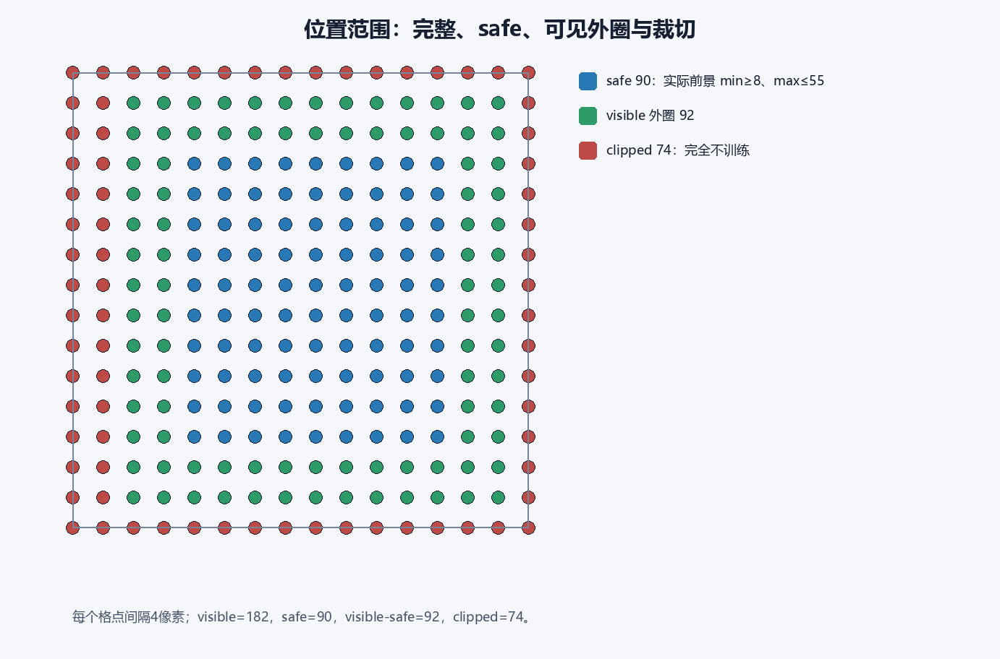
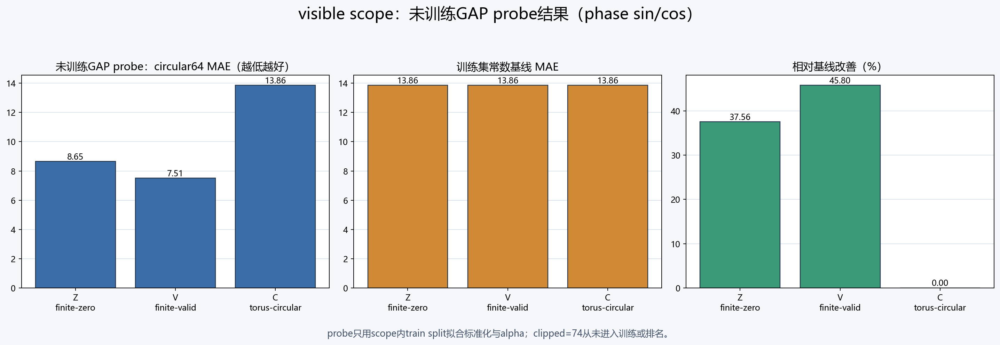
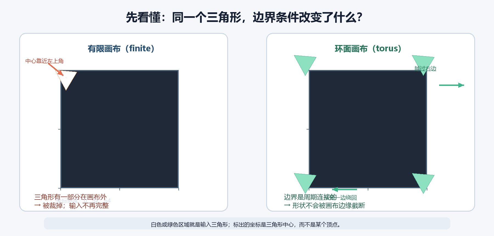

# Track A MiniCNN valid-boundary experiment — public summary

This small controlled experiment compared three stride-1 boundary conditions with shared initialization:

| Condition | Input/network boundary | Spatial path |
|---|---|---|
| Z | finite / explicit zero padding | 64→64→64→64 |
| V | finite / valid padding | 64→62→60→58→56 |
| C | torus / circular padding | 64→64→64→64 |

The formal protocol used two scopes: `visible=182` and the stricter `safe=90`. A clipped subset was retained only as a boundary description and was not used for training or ranking.

## Frozen-feature probe

The primary metric was circular MAE on a 64-pixel period. Near-constant features were zeroed using statistics fitted on the training split only.

| Scope | Z MAE | V MAE | C MAE | Constant baseline |
|---|---:|---:|---:|---:|
| visible | 8.654 px | 7.511 px | 13.858 px | 13.858 px |
| safe | 9.803 px | 9.803 px | 9.803 px | 9.803 px |

## Fixed-step training

Six runs used 500 fixed steps without test-based checkpoint selection.

| Scope | Z MAE | V MAE | C MAE |
|---|---:|---:|---:|
| visible | 13.207 px | 11.486 px | 14.336 px |
| safe | 9.808 px | 9.808 px | 9.808 px |

## Limitations

This is a single-seed, fixed-small-dataset mechanism experiment. Visible and safe scopes have different held-out sets, and torus raw coordinates are seam-sensitive. The result supports only the stated boundary-mechanism comparison.
